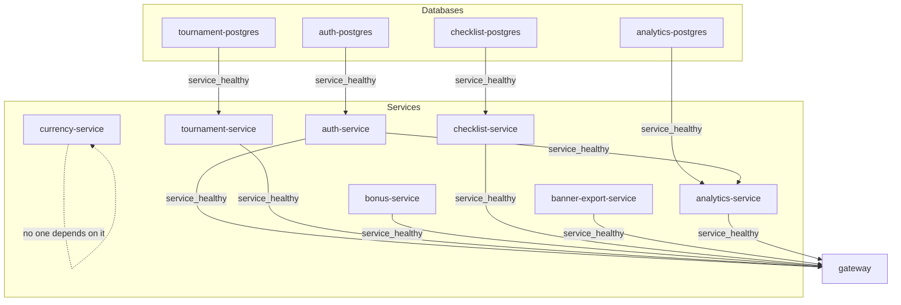

# Docker Compose Topology

Per INF-07. How `docker-compose.yml` is wired: which container waits for
which, how "healthy" is decided, and why one service is deliberately left
out of that graph.

## The stack

12 containers: 4 Postgres databases + 8 application services (7 proxied
services + the gateway). One command brings all of them up:

```bash
docker compose up -d --build
```

| Service | Port | Has its own DB | Calls another service directly | Depended on by |
|---|---|---|---|---|
| `auth-postgres` | 5433→5432 | — | — | `auth-service` |
| `tournament-postgres` | 5435→5432 | — | — | `tournament-service` |
| `checklist-postgres` | 5436→5432 | — | — | `checklist-service` |
| `analytics-postgres` | 5437→5432 | — | — | `analytics-service` |
| `auth-service` | 3001 | ✅ `auth-postgres` | — | `analytics-service`, `gateway` |
| `currency-service` | 3003 | ❌ stateless | — | **nobody** (deliberate) |
| `tournament-service` | 3004 | ✅ `tournament-postgres` | — | `gateway` |
| `bonus-service` | 3005 | ❌ stateless | — | `gateway` |
| `checklist-service` | 3006 | ✅ `checklist-postgres` | — | `gateway` |
| `banner-export-service` | 3007 | ❌ stateless (disk storage) | — | `gateway` |
| `analytics-service` | 3008 | ✅ `analytics-postgres` | `auth-service` (user import/search) | `gateway` |
| `gateway` | 3000 | — | all 7 services above | (the entrypoint) |

## The dependency graph



Every arrow is a `depends_on: { <upstream>: { condition: service_healthy } }`
entry. `currency-service` has no incoming arrows from anything, and it isn't
in anyone's `depends_on` — see [Why currency-service is excluded](#why-currency-service-is-excluded-from-the-graph)
below.

## What `condition: service_healthy` actually does

By default, Compose's `depends_on` only waits for the *container process* to
start (`condition: service_started`) — not for the application inside it to
be ready. That's what this stack used to rely on implicitly, and it's too
weak: a Nest app can take a few seconds to boot (module init, Prisma client,
etc.), during which it isn't actually able to serve requests yet.

`condition: service_healthy` instead makes Compose wait until the upstream
container's own `HEALTHCHECK` reports **healthy** before starting anything
that depends on it. Two different healthcheck mechanisms are in play here:

- **Postgres containers**: `pg_isready -U postgres` — a tool built into the
  `postgres` image, checking the database is accepting connections.
- **Application containers**: every service already exposes `GET /health`
  (liveness) via the shared `HealthModule` (see
  `docs/service-communication.md`). The healthcheck hits that endpoint from
  inside the container:
  ```yaml
  healthcheck:
    test: ["CMD", "node", "-e", "fetch('http://localhost:<port>/health').then(r=>{if(!r.ok)process.exit(1)}).catch(()=>process.exit(1))"]
    interval: 10s
    timeout: 5s
    retries: 5
    start_period: 15s
  ```
  It uses `node -e` with the runtime's built-in global `fetch()` rather than
  `curl`/`wget`, because the runtime image (`node:24.17-slim`) doesn't have
  either installed and there's no reason to add a package just for this.
  `start_period: 15s` gives the app a grace window to finish booting before
  failed checks start counting toward `retries`.

  This `healthcheck:` block is defined once (as a YAML anchor,
  `&app-healthcheck`, on `auth-service`) and reused via `<<: *app-healthcheck`
  on every other app service, each overriding only the `test:` line with its
  own port — so there's one shape to keep in sync, not eight independent
  copies.

## Startup order this produces

1. **Postgres containers** start first (no dependencies of their own) and
   run until `pg_isready` succeeds.
2. **`auth-service`, `tournament-service`, `checklist-service`** each wait
   for their own Postgres to be healthy, then start, then run until their
   own `/health` check passes.
3. **`analytics-service`** waits for both `analytics-postgres` *and*
   `auth-service` to be healthy — it calls `auth-service` directly (not
   through the gateway) for team-member import/search, so it genuinely needs
   auth up first, not just its own database.
4. **`bonus-service`, `banner-export-service`, `currency-service`** have no
   upstream dependencies (no DB, no service-to-service calls) — they start
   immediately, in parallel with everything else.
5. **`gateway`** waits for `auth-service`, `tournament-service`,
   `bonus-service`, `checklist-service`, `banner-export-service`, and
   `analytics-service` to all be healthy — it proxies to all of them, so
   none of them should be able to 502 a request just because the gateway
   won the startup race.

## Why `currency-service` is excluded from the graph

`currency-service` is unfinished — `TranslationService` requires
`GOOGLE_TRANSLATE_API_KEY` via `configService.getOrThrow(...)`, with no
fallback, so it depends on an outside API key being available to even boot
cleanly. That's a real, external dependency the rest of the stack has no
control over.

Rather than let that uncertainty leak into the stack's startup, the fix is
structural: **nothing in this compose file has `currency-service` in its
`depends_on`.** Concretely:

- `gateway` calls `currency-service` (via `CurrencyProxyController`), and
  does have `CURRENCY_SERVICE_URL` set — but it does **not** wait on
  `currency-service` to be healthy before starting. If `currency-service` is
  crash-looping, the gateway still boots and serves every other route
  normally; only requests that specifically hit `/currency/*` would fail
  until `currency-service` recovers.
- No other service references `currency-service` at all.

So even if `currency-service` crash-loops indefinitely (e.g. missing/invalid
`GOOGLE_TRANSLATE_API_KEY`), `docker compose up -d` still brings up all 11
other containers successfully — verified: bringing the whole stack up with
one command and checking `GET /health/system` on the gateway shows every
service healthy independently of `currency-service`'s own state. This is
the deliberate, minimal way to satisfy "an unfinished service must not block
startup" without special-casing Compose's dependency resolution.

## The `APP_NAME` mechanism

All 8 app services build from the same `Dockerfile` and the same `npm run
build:all` (which compiles every app into `dist/apps/<name>` regardless of
which service is being built) — the only thing that differs between them is
which one actually runs. That's selected at **container start**, not build
time: each service sets `APP_NAME: <service-name>` under `environment:`, and
the image's `CMD` reads it back: `node dist/apps/${APP_NAME}/main`.

This has to be a runtime environment variable, not a Docker build arg — a
build arg never survives into the running container unless the Dockerfile
re-captures it with `ENV` in the final stage, which this Dockerfile
deliberately doesn't do (its own top comment explains why: not every hosting
dashboard, i.e. Render, exposes build-arg configuration, but every one lets
you set a runtime env var per deployed service). `docker-compose.yml` now
mirrors that same mechanism for local dev, so what works locally matches how
it's actually deployed.
